# Rapport de TP - Application Spring MVC JPA

Layla EL HAJJAJI (BDDC2)

## 1. Contexte et objectif

Ce TP consiste a developper une application web Java basee sur Spring Boot pour gerer des produits.
L'application couvre les operations principales de consultation, ajout et suppression, avec:

- une couche web (Spring MVC + Thymeleaf),
- une couche metier/persistance (Spring Data JPA),
- une base H2 en memoire,
- une securite Spring Security avec gestion des roles.

L'objectif principal est de mettre en pratique une architecture MVC complete, la validation des donnees et la securisation des actions sensibles.

## 2. Technologies utilisees

- Java
- Spring Boot
- Spring MVC
- Spring Data JPA
- Hibernate
- Thymeleaf
- Spring Security
- H2 Database
- Bootstrap (WebJars)

## 3. Structure fonctionnelle

L'application propose les parcours suivants:

1. Afficher la liste des produits.
2. Ajouter un nouveau produit via un formulaire.
3. Valider les donnees saisies (nom, prix, quantite).
4. Supprimer un produit (action reservee selon les droits).
5. Verifier les autorisations avec redirection vers une page de refus si necessaire.

## 4. Resultats et observations

- La liste des produits est correctement affichee depuis la base H2.
- L'ajout est operationnel et met a jour la liste apres sauvegarde.
- Les regles de validation bloquent les saisies invalides et affichent les messages d'erreur.
- La suppression fonctionne pour les utilisateurs autorises.
- Les utilisateurs non autorises sont bloques et rediriges vers une page dediee.
- L'interface a ete amelioree par Bootstrap (tableaux, boutons, barre de navigation).

## 5. Figures (captures d'ecran)

### Figure 1 - Demarrage de l'application et traces d'execution
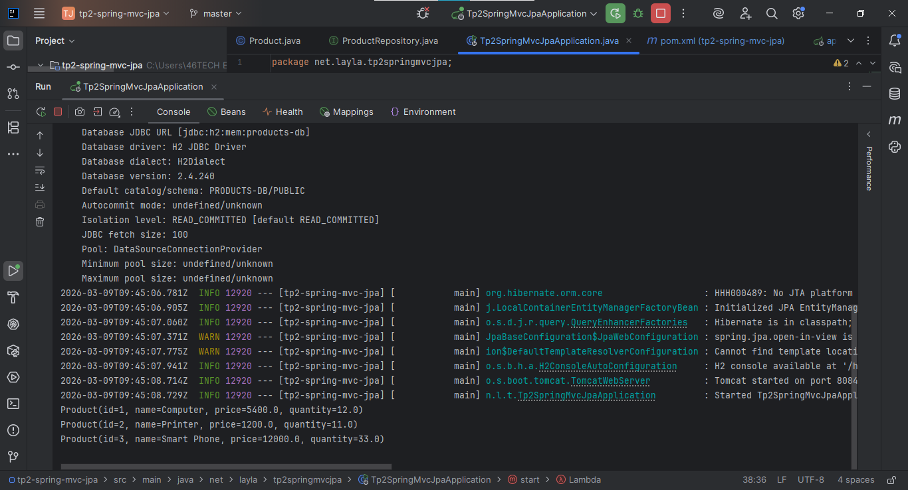

### Figure 2 - Configuration H2 visible dans le terminal
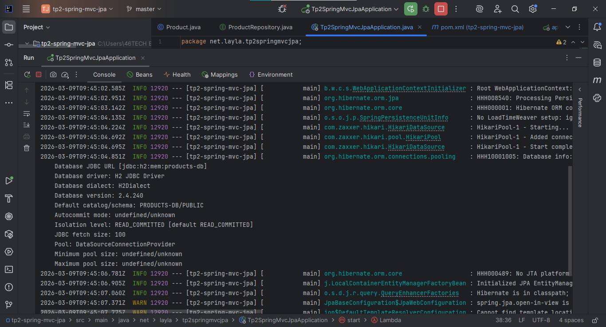

### Figure 3 - Connexion a la console web H2
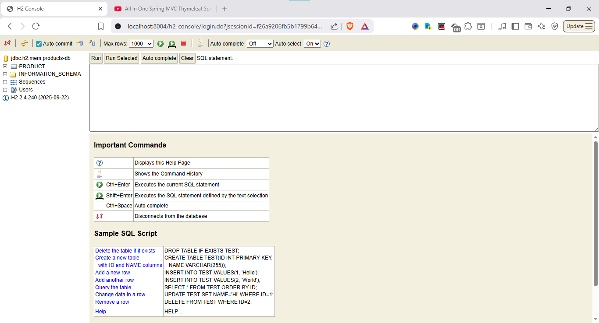

### Figure 4 - Verification SQL des donnees (SELECT sur PRODUCT)
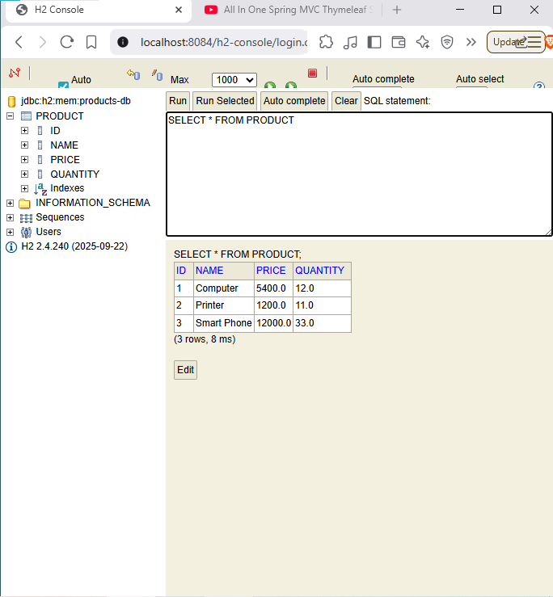

### Figure 5 - Affichage HTML de la page index
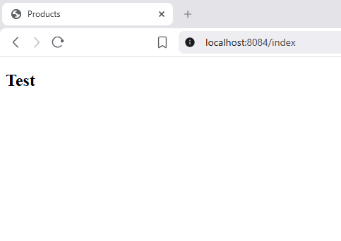

### Figure 6 - Premiere vue simple de la liste des produits
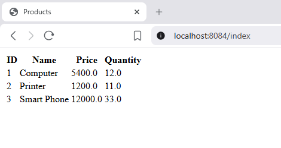

### Figure 7 - Interface produits amelioree avec Bootstrap
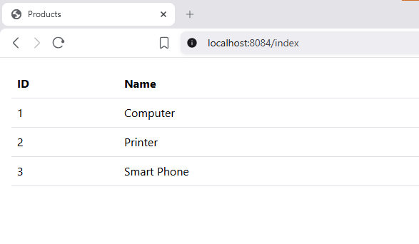

### Figure 8 - Ajout de la barre de navigation
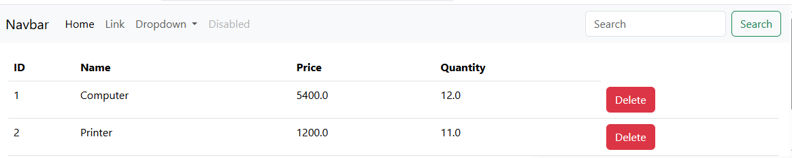

### Figure 9 - Ajout du bouton de suppression
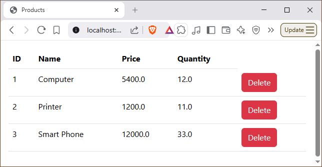

### Figure 10 - Boite de confirmation avant suppression
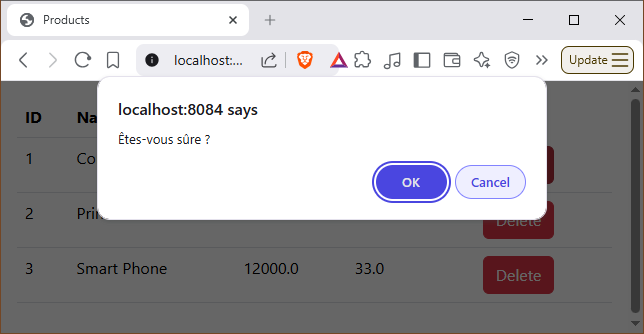

### Figure 11 - Suppression effectuee
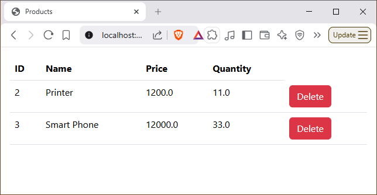

### Figure 12 - Formulaire d'ajout d'un nouveau produit
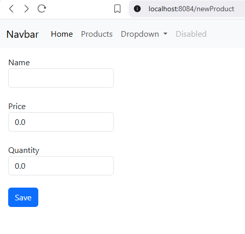

### Figure 13 - Validation des champs du formulaire
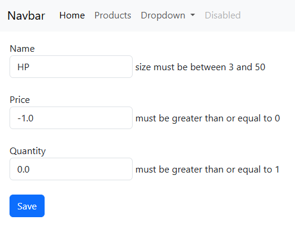

### Figure 14 - Produit ajoute avec succes
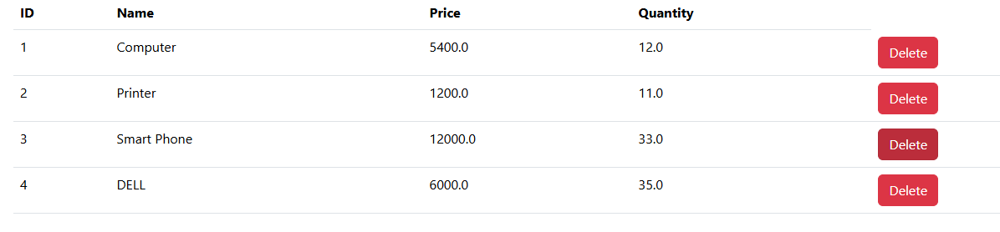

### Figure 15 - Test de suppression
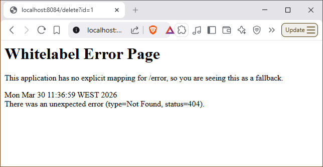

### Figure 16 - Actions desactivees pour utilisateur non admin
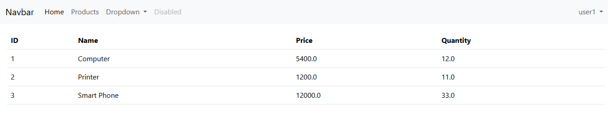

### Figure 17 - Acces refuse (Not Authorized)
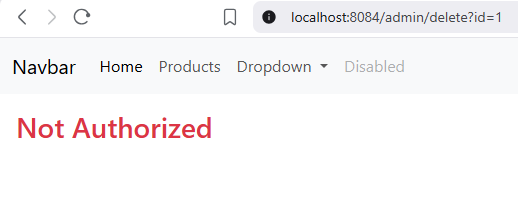

## 6. Conclusion

Ce TP a permis de realiser une application web complete en Spring Boot, avec une separation claire des couches, une persistance JPA, une interface Thymeleaf/Bootstrap et une securite par roles.
Les captures montrent la progression du travail depuis les premiers tests jusqu'a l'interface finale securisee.
